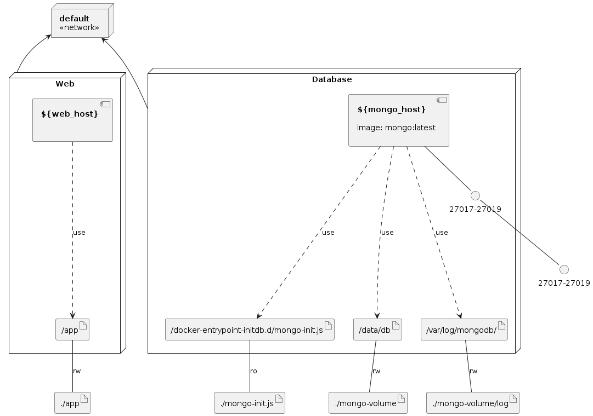

# Convert-XML-to-JSON-and-Import-JSON-to-MongoDB
Convert XML to JSON and Import JSON to MongoDB.

### Infrastructure model



For this documentation, I have an interesting full article that I recommend you [Convertir XML a JSON e Importar JSON a MongoDB con Python y Docker](https://www.crashell.com/estudio/convertir_xml_a_json_e_importar_json_a_mongodb_con_python_y_docker).

#### Manage MongoDB container with Docker Compose

```bash
$ docker-compose up --build -d

Creating network "convert-xml-to-json-and-import-json-to-mongodb_default" with the default driver
Pulling database (mongo:latest)...
latest: Pulling from library/mongo
3b65ec22a9e9: Pull complete
016bc871e2b3: Pull complete
9ddd649edd82: Pull complete
39bf776c01e4: Pull complete
f7f0405a2fe3: Pull complete
417812e2676c: Pull complete
905384a6c9a9: Pull complete
768aa2a1becc: Pull complete
623c0121bf78: Pull complete
Digest: sha256:6f90d92eb8ed5c52eb602a734697b329a0441949d9bb737ddcd5dae56552cac9
Status: Downloaded newer image for mongo:latest
Building web
[+] Building 60.7s (10/15)
...
Creating mongodb ... done
Creating api     ... done
```

```bash
$ docker ps -a
CONTAINER ID   IMAGE                                                COMMAND                  CREATED              STATUS                          PORTS                                  NAMES
e2820f321600   convert-xml-to-json-and-import-json-to-mongodb_web   "python ./import-mon…"   About a minute ago   Exited (0) About a minute ago                                          api
ac19e1fa894f   mongo:latest                                         "docker-entrypoint.s…"   About a minute ago   Up About a minute               0.0.0.0:27017-27019->27017-27019/tcp   mongodb
```

#### Import XML to MongoDB

Import JSON to MongoDB

```bash
docker start api
```

#### Delete All

```bash
rm -rf mongo-volume app/JSON/ app/XML/ && mkdir mongo-volume && touch mongo-volume/.gitkeep
```

#### Delete cache

```bash
docker system prune -a -f && docker builder prune -a -f
```
